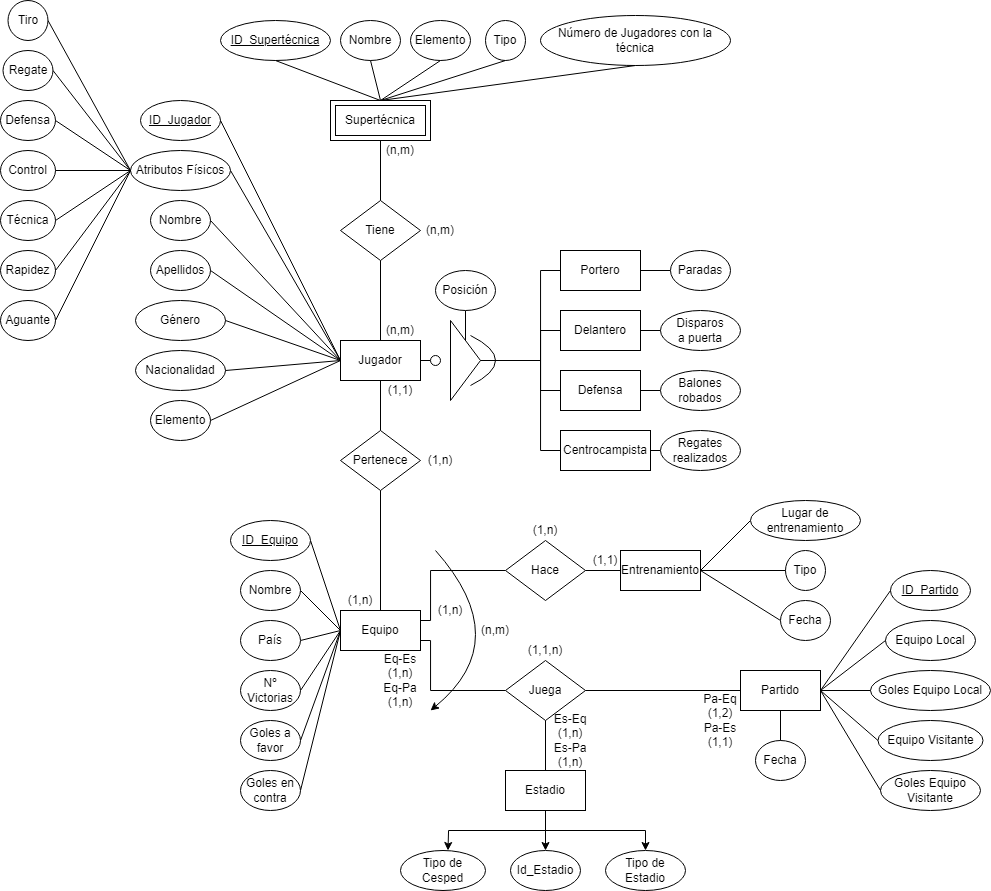
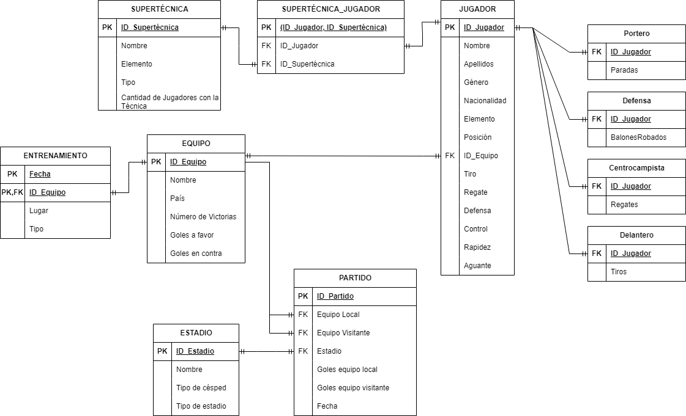

# Inazuma_DB

La Base de Datos del Juego Inazuma Eleven es un proyecto dedicado a compilar y organizar datos relacionados con la serie de videojuegos Inazuma Eleven. Este repositorio funciona como un centro centralizado para aficionados y desarrolladores interesados en acceder y contribuir con información sobre el juego.

Además, es particularmente interesante para aquellos aficionados que deseen armar equipos competitivos de manera sencilla, ya que proporciona recursos valiosos para entender las características y habilidades de los personajes, así como estrategias efectivas para formar equipos exitosos en el juego.

## Autores

- Febe Fariña Aguirre (alu0101430973@ull.edu.es)
- Aday Chocho Aisa (alu0101437538@ull.edu.es)
- Pablo Pais Ficret (alu0101311135@ull.edu.es)

## Diagramas

### Entidad-Relación



### Relacional



## Base de Datos

### Tabla Jugador

```sql	
Tabla con los datos de cada jugador

CREATE TABLE JUGADOR(
  id_jugador SERIAL NOT NULL,
  nombre VARCHAR(10) NOT NULL,
  apellidos VARCHAR(20),
  genero GENERO NOT NULL,
  nacionalidad VARCHAR(20) NOT NULL,
  elemento ELEMENTO NOT NULL,
  posicion VARCHAR(20) NOT NULL,
  id_equipo INTEGER NOT NULL,
  tiro INTEGER NOT NULL,
  Regate INTEGER NOT NULL,
  defensa INTEGER NOT NULL,
  control INTEGER NOT NULL,
  rapidez INTEGER NOT NULL,
  aguante INTEGER NOT NULL,
  PRIMARY KEY(id_jugador)
);
```
- **Id_jugador**: Identificador único del jugador.
- **Nombre**: Nombre del jugador.
- **Apellidos**: Apellidos del jugador.
- **Genero**: Género del jugador.
- **Nacionalidad**: Nacionalidad del jugador.
- **Elemento**: Elemento del jugador.
- **Posicion**: Posición del jugador.
- **Id_equipo**: Identificador del equipo al que pertenece el jugador.
- **Tiro**: Valor de tiro del jugador.
- **Regate**: Valor de regate del jugador.
- **Defensa**: Valor de defensa del jugador.
- **Control**: Valor de control del jugador.
- **Rapidez**: Valor de rapidez del jugador.
- **Aguante**: Valor de aguante del jugador.

### Tabla Equipo

Tabla con los datos de cada equipo

```sql
CREATE TABLE EQUIPO(
  id_equipo SERIAL NOT NULL,
  nombre VARCHAR(20) NOT NULL,
  pais VARCHAR(20) NOT NULL,
  victorias INTEGER NOT NULL,
  goles_a_favor INTEGER NOT NULL,
  goles_en_contra INTEGER NOT NULL,
  PRIMARY key(id_equipo)
);
```

- **Id_equipo**: Identificador único del equipo.
- **Nombre**: Nombre del equipo.
- **Pais**: País del equipo.
- **Victorias**: Número de victorias del equipo.
- **Goles_a_favor**: Suma de goles a favor del equipo de todos sus partidos jugados.
- **Goles_en_contra**: Suma de goles en contra del equipo de todos sus partidos jugados.

### Tabla Supertécnica

Tabla con los datos de cada supertécnica

```sql
CREATE TABLE SUPERTECNICA(
  id_supertecnica SERIAL NOT NULL,
  nombre VARCHAR(20) NOT NULL,
  elemento ELEMENTO NOT NULL,
  tipo TIPO_SUPERTECNICA NOT NULL,
  cantidad_jugadores_con_supertecnica INTEGER NOT NULL,
  PRIMARY KEY(id_supertecnica)
);
```

- **Id_supertecnica**: Identificador único de la supertécnica.
- **Nombre**: Nombre de la supertécnica.
- **Elemento**: Elemento de la supertécnica.
- **Tipo**: Tipo de la supertécnica.
- **Cantidad_jugadores_con_supertecnica**: Número de jugadores que tienen la supertécnica.

### Tabla Partido

Tabla con los datos de cada partido

```sql
CREATE TABLE PARTIDO(
  id_partido SERIAL NOT NULL,
  id_equipo_local INTEGER not NULL,
  id_equipo_visitante INTEGER NOT NULL,
  id_estadio INTEGER NOT NULL,
  goles_local INTEGER,
  goles_visitante INTEGER,
  fecha TIMESTAMP NOT NULL,
  primary key(id_partido)
);
```

- **Id_partido**: Identificador único del partido.
- **Id_equipo_local**: Identificador del equipo local.
- **Id_equipo_visitante**: Identificador del equipo visitante.
- **Id_estadio**: Identificador del estadio en el que se juega el partido.
- **Goles_local**: Goles del equipo local.
- **Goles_visitante**: Goles del equipo visitante.
- **Fecha**: Fecha en la que se juega el partido.

### Tabla Estadio

Tabla con los datos de cada estadio

```sql
CREATE TABLE ESTADIO(
  id_estadio SERIAL NOT NULL, 
  nombre VARCHAR(50) NOT NULL,
  cesped CESPED NOT NULL, 
  tipo TIPO_ESTADIO NOT NULL,
  PRIMARY KEY(id_estadio)
);
```

- **Id_estadio**: Identificador único del estadio.
- **Nombre**: Nombre del estadio.
- **Cesped**: Tipo de césped del estadio.
- **Tipo**: Tipo de estadio.

### Tabla Entrenamiento

Tabla con los datos de cada entrenamiento

```sql
CREATE TABLE ENTRENAMIENTO(
  fecha TIMESTAMP NOT NULL,
  id_equipo INTEGER NOT NULL,
  lugar VARCHAR(20) NOT NULL,
  tipo TIPO_ENTRENAMIENTO not NULL,
  PRIMARY KEY(fecha, id_equipo)
);
```

- **Fecha**: Fecha en la que se realiza el entrenamiento.
- **Id_equipo**: Identificador del equipo que realiza el entrenamiento.
- **Lugar**: Lugar en el que se realiza el entrenamiento.
- **Tipo**: Tipo de entrenamiento.

### Tabla Supertécnica Jugador

Tabla que asocia a cada jugador con sus supertécnicas

```sql
CREATE TABLE SUPERTECNICA_JUGADOR(
  id_jugador INTEGER NOT NULL,
  id_supertecnica INTEGER NOT NULL,
  PRIMARY KEY(id_jugador, id_supertecnica)
);
```

- **Id_jugador**: Identificador del jugador.
- **Id_supertecnica**: Identificador de la supertécnica.

### Tabla Portero

Tabla que asocia a cada jugador con su posisión de portero

```sql
CREATE TABLE PORTERO(
  id_jugador INTEGER NOT NULL,
  paradas INTEGER NOT NULL
);
```

- **Id_jugador**: Identificador del jugador.
- **Paradas**: Número de paradas del jugador.

### Tabla Defensa

Tabla que asocia a cada jugador con su posisión de defensa

```sql
CREATE TABLE DEFENSA(
  id_jugador INTEGER NOT NULL,
  balones_robados INTEGER NOT NULL
);
```

- **Id_jugador**: Identificador del jugador.
- **Balones_robados**: Número de balones robados por el jugador.

### Tabla Centrocampista

Tabla que asocia a cada jugador con su posisión de centrocampista

```sql
CREATE TABLE CENTROCAMPISTA(
  id_jugador INTEGER NOT NULL,
  Regates_realizados INTEGER NOT NULL
);
```

- **Id_jugador**: Identificador del jugador.
- **Regates_realizados**: Número de regates realizados por el jugador.

### Tabla Delantero

Tabla que asocia a cada jugador con su posisión de delantero

```sql
CREATE TABLE DELANTERO(
  id_jugador INTEGER NOT NULL,
  disparos_a_puerta INTEGER NOT NULL
);
```

- **Id_jugador**: Identificador del jugador.
- **Disparos_a_puerta**: Número de disparos a puerta realizados por el jugador.


